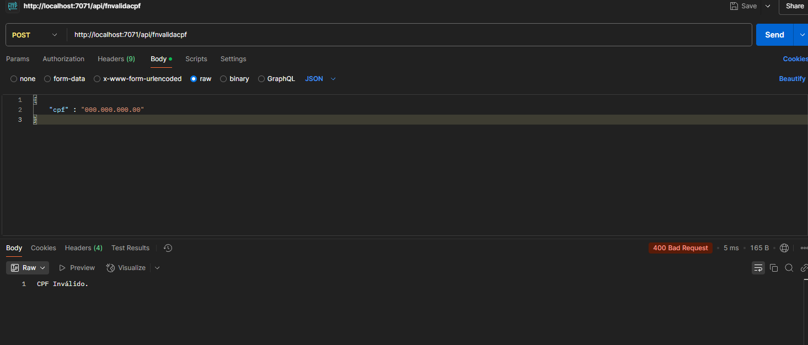

# Validador de CPF Serverless com Azure Functions

## Descrição
Esta é uma aplicação desenvolvida utilizando **Azure Functions** para validar números de CPF de maneira eficiente. O projeto adota uma arquitetura **serverless**, garantindo escalabilidade e custo reduzido, sendo ideal para integração em sistemas que necessitam de validações rápidas e seguras de CPFs.

## Demonstração


## Funcionalidades
- **Validação da estrutura do CPF**: Verifica o formato e os dígitos verificadores.
- **Retorno rápido**: Fornece o status de validade do CPF em tempo real.
- **Implantação fácil**: Pronto para ser implantado em ambientes Azure.

## Ferramentas Necessárias
- [Visual Studio Code](https://code.visualstudio.com/)
- [.NET 8 SDK](https://dotnet.microsoft.com/download/dotnet/8.0)
- [Azure CLI](https://docs.microsoft.com/cli/azure/install-azure-cli)
- [Azure Functions Core Tools](https://docs.microsoft.com/azure/azure-functions/functions-run-local)

## Como Executar
1. **Clone o repositório**:
   ```bash
   git clone https://github.com/AlanBReis/serveless-validar-cpf/
   cd serveless-validar-cpf

2. **Instale as dependências**:
  dotnet restore

3. **Execute localmente**:
  func start


4. **Teste a validação de CPF: Utilize ferramentas como Postman ou Curl para enviar requisições à função.**

